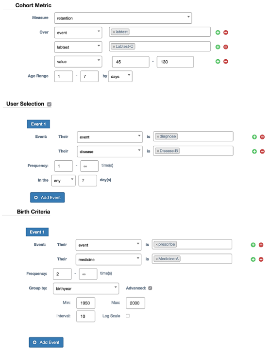
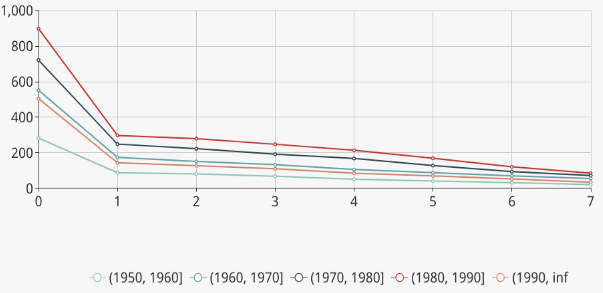
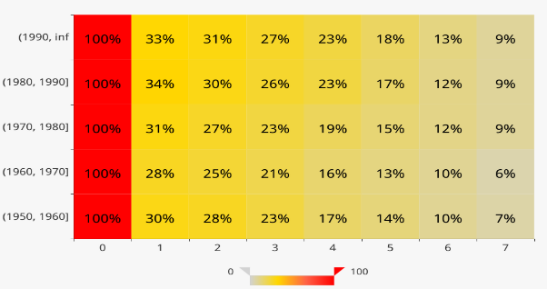

## Introduction to Apache COOL

As a doctor, it’s critical for us to understand the impact we have on patients. The easiest way to do this is cohort analysis. But with a variety of big data accumulated over the years, **query efficiency** becomes one of the problems OnLine Analytical Processing (OLAP) systems meet, especially for cohort analysis. Therefore, Apache COOL was designed to solve the problem.

**[Apache COOL](http://13.212.103.48:3001/) is a cohort OLAP system specialized for cohort analysis with extremely low latency.**

With the support of several newly proposed operators on top of a sophisticated storage layer, Apache COOL extends conventional OLAP systems. It could process both cohort queries and OLAP queries with superb performance.

## How to perform cohort analysis with Apache COOL?

There are some simple concepts we need to know before performing cohort analyses.

- **Birth Action**: A series of actions we want to study and we need to set up the actions first.
- **User Birth**: A user is born when he finishes the birth actions we set up.
- **Birth Time**: The time when the user is born.
- **Age**: The age of the user is the number of time units passed since his birth.
- **Metric**: User-defined calculation function, such as SUM, AVERAGE and RETENTION.
- **Cohort**: A group of users sharing certain common characteristics when born. A user is selected into a cohort when born. We could select some features as the criterion. For example, if we select "country" as the criterion, then all the users will be selected into different country cohorts, such as the Singapore cohort, America cohort and China cohort.

## Example of cohort analysis

An example of settings of Apache COOL is as follows:

Here, only patients diagnosed with disease B will be selected for the analysis. The birth action for patients is taking medicine A twice. The time unit of age is one day. The metric is to count patients with abnormal values in lab-test C. For each patient, the measured period, the range of the age, is the following 7 days after taking medicine A twice. Patients are selected into different cohorts according to their birth year.

Finally, we could obtain the analysis results as follows:

In the line map, each line stands for a cohort in which the patients are born in the same decade. The line map could not only illustrate the trend of patients' behavior along the time but also offer a view of the difference between different cohorts.

The heat map is presented along with age and cohorts. Different colors give spontaneous expression on the evolvement of patient behavior and indicate deep insight into patient behavior between different cohorts.

From the two charts, we can observe that younger patients are easier to exhibit side effects, while elder patients take longer to get accustomed to the medicine.

## The applications of Apache COOL with AI

### Is the criterion for cohorts effective?

There are many criteria to divide the cohorts. So how to evaluate the cohorts? It's a hard problem because there are no regular distance metrics and evaluations about patients and cohorts. We could combine Apache COOL with metric learning to find an appropriate distance metric to measure the similarities between patients. Then we could measure the cohorts with the average similarities in the same cohorts and between different cohorts. In this way, the more similar the patients in the same cohort are and the more different the patients in different cohorts are, the better the criterion is. Therefore, we could perform cohort analyses as many as we want and select the most effective criterion to dig deeper.

For example, we may have several assumptions to find what factors will influence mortality after admission to the ICU in 48 hours. Then we could perform cohort analyses with Apache COOL according to our assumptions and compare the effectiveness of different assumptions. Finally, we could precisely find the important factors.

### Processing for missing values

There are many missing values in Electronic Health Record(EHR). We have many methods to deal with missing values, such as mean imputation, hot deck imputation and regression imputation. Now we have a new method to estimate the missing values with cohorts analysis. We could replace the missing values by averaging the corresponding values of the patients in the same cohort. We should note that this method could be applied to other estimation tasks. 

### Features enhancement

When the criterion is effective, the patterns of different cohorts are different. Therefore, the representations for different cohorts are different. As a result, if we want to obtain the embeddings of patients with a model, it's better to train different models for different cohorts. Then we could directly train with the embeddings or regard the embeddings as enhanced features to train with other data.

In healthcare, interpretability is of vital importance and we cannot train with uninterpretable features or models. With Apache COOL, we could obtain interpretable cohorts or features. So Apache COOL will bring a lot of benefits and convenience to healthcare.

## Conclusion

This is a blog about Apache COOL. We focus on more efficient cohort queries and how to utilize the results of cohorts analyses in healthcare. We will keep developing Apache COOL and make it better. Thank you to everyone for reading and to the entire community that supports Apache COOL.
