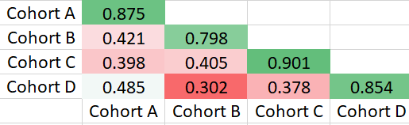
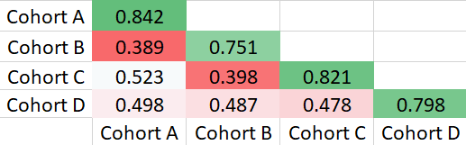
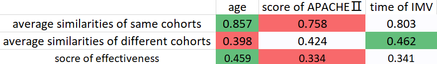
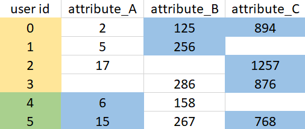
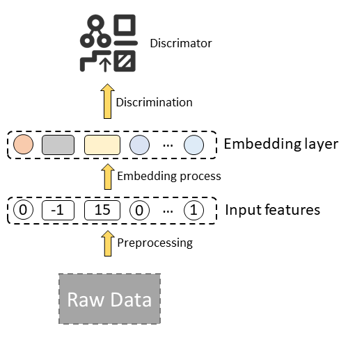
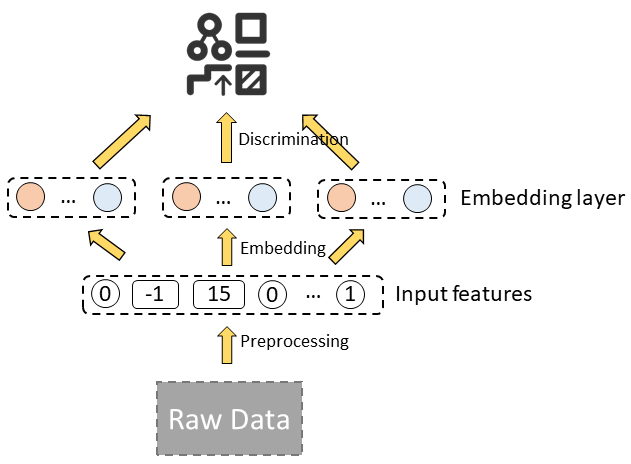
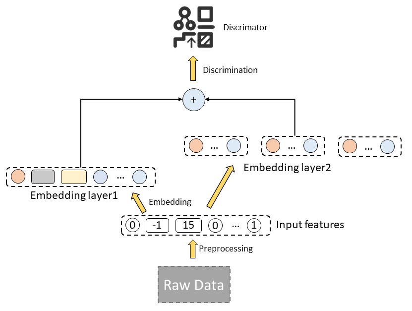

## Introduction to COOL

In our life, different groups of people often have different behaviors or trends. For example, the bones of older people are more porous than those of younger people, and people who exercise more are healthier than those who don't. It is of great value to explore the behaviors and trends of different groups of people, especially in healthcare, because we can adopt appropriate measures based on the behaviors and trends to make the situation better. The easiest way to do this is **cohort analysis**. But with a variety of big data accumulated over the years, **query efficiency** becomes one of the problems OnLine Analytical Processing (OLAP) systems meet, especially for cohort analysis. Therefore, COOL was designed to solve the problem.

**[ COOL](http://13.212.103.48:3001/) is a cohort OLAP system specialized for cohort analysis with extremely low latency.**

With the support of several newly proposed operators on top of a sophisticated storage layer, COOL extends conventional OLAP systems. It could process both cohort queries and OLAP queries with superb performance.

## How to perform cohort analysis with COOL?

There are some simple concepts we need to know before performing cohort analyses.

- **Birth Action**: A series of actions we want to study and we need to set up the actions first.
- **User Birth**: A user is born when he finishes the birth actions we set up.
- **Birth Time**: The time when the user is born.
- **Age**: The age of the user is the number of time units passed since his birth.
- **Metric**: User-defined calculation function, such as SUM, AVERAGE and RETENTION.
- **Cohort**: A group of users sharing certain common characteristics when born. A user is selected into a cohort when born. We could select some features as the criterion. For example, if we select "country" as the criterion, then all the users will be selected into different country cohorts, such as the Singapore cohort, America cohort and China cohort.

## Example of cohort analysis

An example of settings of COOL is as follows:

Here, only patients diagnosed with disease B will be selected for the analysis. The birth action for patients is taking medicine A twice. The time unit of age is one day. The metric is to count patients with abnormal values in lab-test C. For each patient, the measured period, the range of the age, is the following 7 days after taking medicine A twice. Patients are selected into different cohorts according to their birth year.

Finally, we could obtain the analysis results as follows:

In the line map, each line stands for a cohort in which the patients are born in the same decade. The line map could not only illustrate the trend of patients' behavior along the time, but also offer a view of the difference between different cohorts.

The heat map is presented along with age and cohorts. Different colors give spontaneous expression on the evolvement of patient behavior and indicate deep insight into patient behavior among different cohorts.

From the two charts, we can observe that younger patients are easier to exhibit side effects, while elder patients take longer to get accustomed to the medicine.

## The applications of COOL with AI

### Is the criterion for cohorts effective?

We can evaluate the effectiveness of cohort analysis with COOL and metric learning. There are many criteria to divide the cohorts, so how to evaluate the cohorts? It's a hard problem because there are no regular distance metrics and evaluations about patients and cohorts. We could combine COOL with metric learning to find an appropriate distance metric to measure the similarities between patients. Then we could measure the cohorts with the average similarities in the same cohorts and between different cohorts. In this way, the more similar the patients in the same cohort are and the more different the patients in different cohorts are, the better the criterion is. Therefore, we could perform cohort analyses as many as we want and select the most effective criterion to dig deeper.

For example, we may have several assumptions to find what factors will influence mortality after admission to the ICU in 48 hours. After performing cohort analyses with COOL and viewing the heat maps and line maps, we find that age, score of APACHEⅡ, the time of invasive mechanical ventilation will influence the mortality. Then we can compare the effectiveness of different factors to find exactly the most important factor. We may obtain tables of similarities for different factors as follows:

The table of similarities for age:

The table of similarities for score of APACHEⅡ:

The table of similarities for the time of invasive mechanical ventilation:

Finally, we can get the summary table for these factors.

In the summary table, the score of effectiveness is defined as the difference between the average similarity of same cohorts and the average similarity of different cohorts because we hope that the patients in the same cohort are similar and the patients in different cohorts are different. Finally, we can conclude that age is the most important factor.

### Processing for missing values

Estimating the missing value with COOL is an effective method and may have surprising effects. There are many missing values in big data, and we have many methods to deal with missing values, such as mean imputation, hot deck imputation and regression imputation. Now we have a new method to estimate the missing values with cohorts analysis. We could replace the missing values by averaging the corresponding values of the users in the same cohort.

For example, in a recommender system, if we consider the value to predict as the missing value, then we can extend Collaborative Filtering Approach with COOL.

In the table, users 0, 1, 2 and 3 are in the same cohort. Users 4 and 5 are in the same cohort.
In general, we need to find the top k similar users to the query user and then compute the predicted value of query user. Now we can extend the method to find the top k similar users in the same cohort as the query user. Now if we want to predict the missing value of attribute_B for user 2 and set the parameter k to 2, we need to find the top 2 similar users in users 0, 1 and 3. Users 4 and 5 will not involve because they are in the different cohort from user 2.

### Interpretable Features enhancement

In some fields, such as healthcare, interpretability is of vital importance and we cannot train with uninterpretable features or models, but cohort analysis with COOL could provide interpretable cohorts or features. When the criterion of cohorts is effective, the patterns of different cohorts are different. Therefore, the representations for different cohorts are different. As a result, if we want to obtain the embeddings of users with an embedding model, it's better to train different models for different cohorts.

For example, now we have a simple approach and the structure of the method is as follows:

There are mainly two layers, preprocessing layer and embedding layer. Preprocessing layer is used to precess the raw data and embedding layer is to get the embedding of raw features.

We believe the representations for different cohorts are different. So we can restructure the embedding layer and apply different embedding models to different cohorts to make the embeddings more precise and effective.

Or we can regard the new embeddings as enhanced features for raw embedding.

## Conclusion

In a word, COOL is an efficient cohort OLAP system specialized for cohort analysis with extremely low latency. Cohort analysis with COOL can be applied to any situation where the property of the cohort is useful to individuals and it will do good to the tasks. So why not take a look at what COOL can do for your mission?