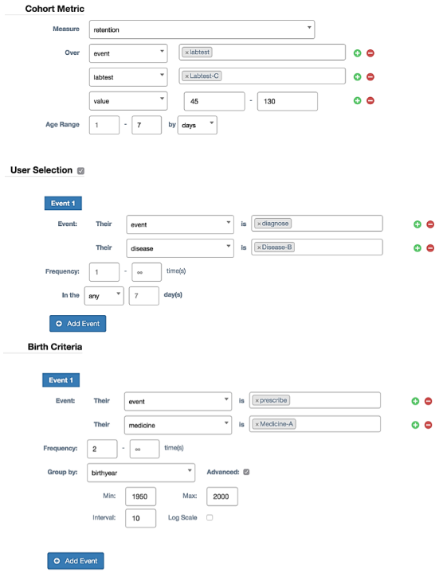
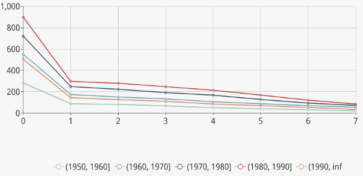
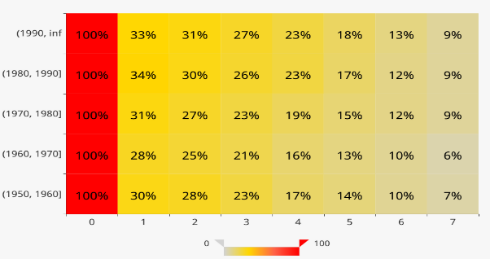
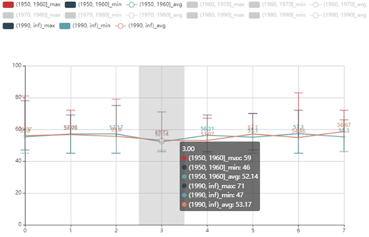

## Introduction to COOL

In our life, different groups of people often have different behaviors or trends. For example, the bones of older people are more porous than those of younger people, and people who exercise more are healthier than those who don't. It is of great value to explore the behaviors and trends of different groups of people, especially in healthcare, because we can adopt appropriate measures based on the behaviors and trends to make the situation better. The easiest way to do this is **cohort analysis**. But with a variety of big data accumulated over the years, **query efficiency** becomes one of the problems OnLine Analytical Processing (OLAP) systems meet, especially for cohort analysis. Therefore, COOL was designed to solve the problem.

**[ COOL](http://13.212.103.48:3001/) is a cohort OLAP system specialized for cohort analysis with extremely low latency.**

With the support of several newly proposed operators on top of a sophisticated storage layer, COOL extends conventional OLAP systems. It could process both cohort queries and OLAP queries with superb performance.

## How to perform cohort analysis with COOL?

There are some simple concepts we need to know before performing cohort analyses.

- **Birth Action**: A series of actions we want to study and we need to set up the actions first.
- **User Birth**: A user is born when he finishes the birth actions we set up.
- **Birth Time**: The time when the user is born.
- **Age**: The age of the user is the number of time units passed since his birth.
- **Metric**: User-defined calculation function, such as SUM, AVERAGE and RETENTION.
- **Cohort**: A group of users sharing certain common characteristics when born. A user is selected into a cohort when born. We could select some features as the criterion. For example, if we select "country" as the criterion, then all the users will be selected into different country cohorts, such as the Singapore cohort, America cohort and China cohort.

## Example of cohort analysis

An example of settings of COOL is as follows:

Here, only patients diagnosed with disease B will be selected for the analysis. The birth action for patients is taking medicine A twice. The time unit of age is one day. The metric is to count patients with abnormal values in lab-test C. For each patient, the measured period, the range of the age, is the following 7 days after taking medicine A twice. Patients are selected into different cohorts according to their birth year.

Finally, we could obtain the analysis results as follows:

In the line map, each line stands for a cohort in which the patients are born in the same decade. The line map could not only illustrate the trend of patients' behavior along the time, but also offer a view of the difference between different cohorts.

The heat map is presented along with age and cohorts. Different colors give spontaneous expression on the evolvement of patient behavior and indicate deep insight into patient behavior among different cohorts.

The range map shows some statistical information of cohorts (i.e. minimum, maximum and average). The range map provides an overview of the abnormal values we want to study and a novel way to compare different cohorts and find more different features among cohorts.

From the three charts, we can observe that younger patients are easier to exhibit side effects, while elder patients take longer to get accustomed to the medicine. Most abnormal values are below 55 and few values are higher than 80. We can explore further according to the medical meaning of the values.

## Conclusion

In a word, COOL is an efficient and user-friendly cohort OLAP system specialized for cohort analysis with extremely low latency. Cohort analysis with COOL can be applied to any situation where the property of the cohort is useful to individuals and it will do good to the tasks. So why not take a look at what COOL can do for your mission?