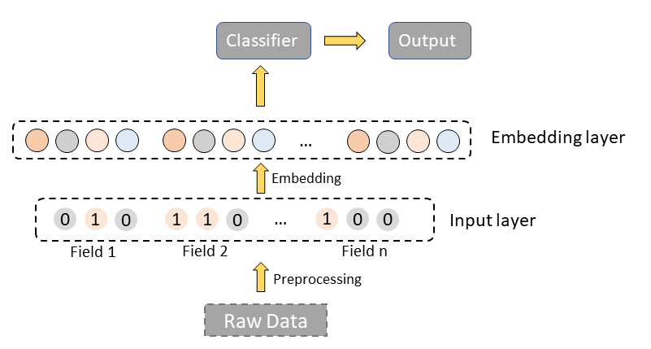

## Introduction

Nowadays, most applications of cohort analysis are very simple. In most cases, users are divided into different cohorts according to some attribute. For example, most papers with cohort analysis in medicine will divide patients according to their age or birthplace. Then only some simple statistical data of cohorts like average value or sum will be used. Although these are the easiest way to perform cohort analysis, they cannot provide a deeper insight into cohorts to us. We still need more effective methods.

As we have talked about in the previous blog, **[ COOL](http://13.212.103.48:3001/) is a cohort OLAP system specialized for cohort analysis with extremely low latency.** It could process both cohort queries and OLAP queries with superb performance. With COOL, we could obtain more complex and precise cohorts. In addition, it's of great value to combine COOL with AI to dig deeper into the data.

## The applications of COOL with AI

### Is the criterion for cohorts effective?

We can evaluate the effectiveness of cohort analysis with COOL and metric learning. There are many criteria to divide the cohorts, so how to evaluate the cohorts? It's a hard problem because there are no regular distance metrics and evaluations about patients and cohorts. We could combine COOL with metric learning to find an appropriate distance metric to measure the similarities between patients. Then we could measure the cohorts with the average similarities in the same cohorts and between different cohorts. In this way, the more similar the patients in the same cohort are and the more different the patients in different cohorts are, the better the criterion is. Therefore, we could perform cohort analyses as many as we want and select the most effective criterion to dig deeper.

For example, we may have several assumptions to find what factors will influence mortality after admission to the ICU in 48 hours. After performing cohort analyses with COOL and viewing the maps, we find that age, score of APACHEⅡ, the time of invasive mechanical ventilation will influence the mortality. Then we can compare the effectiveness of different factors to find exactly the most important factor. We may obtain tables of similarities for different factors as follows:

The table of similarities for age:

The table of similarities for score of APACHEⅡ:

The table of similarities for the time of invasive mechanical ventilation:

Finally, we can get the summary table for these factors.

In the summary table, the score of effectiveness is defined as the difference between the average similarity of same cohorts and the average similarity of different cohorts because we hope that the patients in the same cohort are similar and the patients in different cohorts are different. Finally, we can conclude that age is the most important factor.

### Process for missing values

Estimating the missing value with COOL is an effective method and may have surprising effects. There are many missing values in big data, and we have many methods to deal with missing values, such as mean imputation, hot deck imputation and regression imputation. Now we have a new method to estimate the missing values with cohorts analysis. We could replace the missing values by averaging the corresponding values of the users in the same cohort.

For example, in a recommender system, if we consider the value to predict as the missing value, then we can extend Collaborative Filtering Approach with COOL.

In the table, users 0, 1, 2 and 3 are in the same cohort. Users 4 and 5 are in the same cohort.
In general, we need to find the top k similar users to the query user and then compute the predicted value of query user. Now we can extend the method to find the top k similar users in the same cohort as the query user. Now if we want to predict the missing value of attribute_B for user 2 and set the parameter k to 2, we need to find the top 2 similar users in users 0, 1 and 3. Users 4 and 5 will not involve because they are in the different cohort from user 2.

### Interpretable Features enhancement

In some fields, such as healthcare, interpretability is of vital importance and we cannot train with uninterpretable features or models, but cohort analysis with COOL could provide interpretable cohorts or features. When the criterion of cohorts is effective, the patterns of different cohorts are different. Therefore, the representations for different cohorts are different. As a result, if we want to obtain the embeddings of users with an embedding model, it's better to train different models for different cohorts.

For example, now we have a simple approach and the structure of the method is as follows:

There are mainly two layers, preprocessing layer and embedding layer. Preprocessing layer is used to precess the raw data and embedding layer is to get the embedding of raw features.

We believe the representations for different cohorts are different. So we can restructure the embedding layer and apply different embedding models to different cohorts to make the embeddings more precise and effective.

Or we can regard the new embeddings as enhanced features for raw embedding.

## Conclusion

Cohort analysis is a very effective method on top of individual analysis. Combining cohort analysis with AI will provide us with a brand new view to find more features of different cohorts. If you want to dip more into your data, have a try with COOL. The results may surprise you.