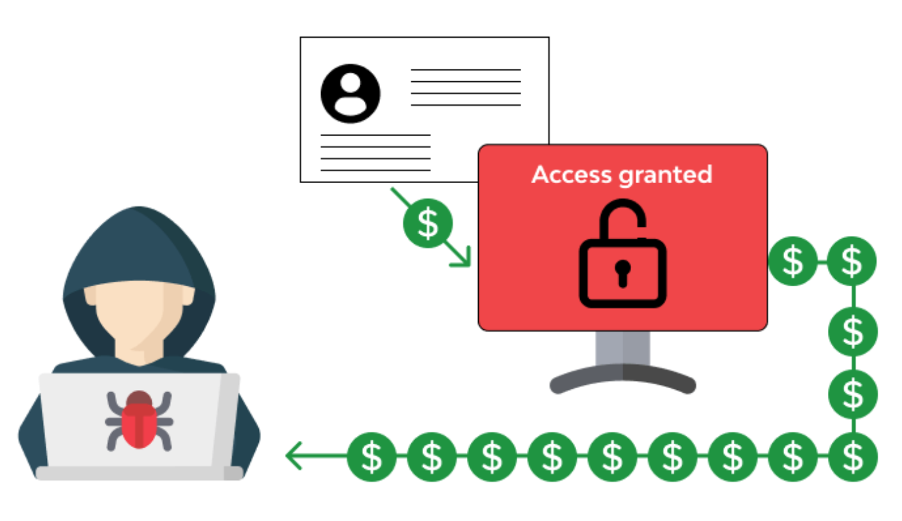

# Cohort Analysis on E-commerce (Case 2)
## Fraud Detection
Cohort analysia are also of great importance for anti-fraud. One of the most important fraud characteristics is that fraudsters tend to reduce the time and resource costs when they conduct various fraudulent activities. For instance, frauster may perform Brushing fraud to improve the page view or sales volume of one product, they will try to apply the required operations using a few devices within a short time range. Because of that, we can group the suspicious accounts based on their deviceID, the purchasing time and other related actions. We take four common fraud types as examples to show how to apply cohort analysis over anti-fraud for e-commerce platforms.

The four common fraud types:

- **Account takeover fraud**: it occurs when fraudsters gain access to a normal user’s account on an ecommerce site or website;
- **Credit card test fraud**: fraudsters visit an ecommerce website, making small test purchases, often using scripts or bots to test multiple credit card numbers quickly. These initial purchases are extremely small, as the entire purpose is to see whether the credit card can be used ;
- **Chargeback fraud**: it occurs when some suspicious claim the transaction was invalid after purchasing an item on the platform successfully;
- **Refund fraud**: it occurs when someone uses a stolen credit card to make a purchase on an ecommerce website. The fraudster then contacts the ecommerce business and request a refund of the excess amount, but then state that the money will need to be sent via an alternative method since their credit card is closed.

For **account takeover fraud**, the cohort selection can be based on the password change information and we can analyse the device/IP login of the accounts to verify the risk. Generally, speaking, a normal user's account information is rarely updated. However, once an account is taken over, the hacker will first update the password and other information to prevent the account from being taken back with the original user. This is especially true when a group of accounts that have not been closely related to each other use the same IP address to change information over a similar period of time. These account groups can be treated as cohorts, among which the accounts are most likely controlled by the same hacker. In order to verify that these cohorts are actually taken over, we can continue to track the login IP address and login frequency of these accounts. For those accounts which frequently change the IP address or the login frequency is very different from before can be identified as **account takeover fraud**.

**Credit card test fraud** is another very important form of fraud. When fraudsters use a stolen credit card for the first time, they usually need to add it to their usual payment method. To avoid attracting the attention of card owners and banks with large purchases, fraudsters start with a small purchase. The cohort selection of **Credit card test fraud** is based on the update of credit card and small purchase using similar IP/deviceID within a short period of time. Following the small purchase, fraudsters may make large purchases that seldom occurs in this user's puchasing history.

**Chargeback fraud** and **Refund fraud** may occur when they have purchased a product and maed payment successfully. By claiming an invalid transaction, **Chargeback fraud** fraudsters can get the money back but not returning back the products. For **Refund fraud**, frausters make payments using a stolen credit card and refund to their own card. Similar to the **Credit card test fraud**, they can also be grouped based on the device aggregation and time aggregation.

