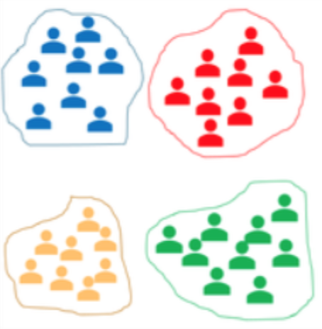
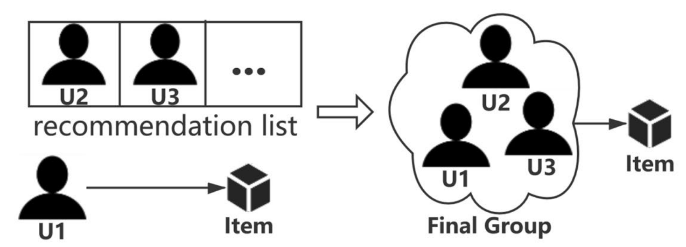
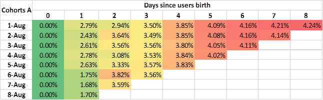
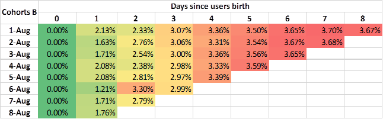

# Cohort Analysis on E-commerce (Case 1)
Cohorts can be divided into acquisition cohorts and behavioral cohorts based on the  group channels. For instance, a group of users who register new accounts on one platform in the same day can be grouped as a cohort, which is a very common acquisition cohort. By contrast, a behavioral cohort refers to a group of users who perform the similar actions in a specified time. By defining the cohorts properly, we can efficiently analyse their behavioral patterns in the platform and make predictions over their future purchase and other behaviors. Cohort analysis on E-commerce is of great importance for item recommendation, retention analysis and fraud detection. The existing recommendation systems generally make recommendations based on the user's own behavior data and the purchase records of other similar users. Most anti-fraud solutions are also designed to address large-scale fraud activities. These very important e-commerce businesses can be further improved in efficiency and effectiveness with cohort analysis.

## Why is cohort analysis important in E-commerce?
Conventional statistical approaches and machine learning methods are the two popular ways to analyse the user data and evaluate the metrics for e-commerce. However, conventional statistical approaches can mislead analysts' decisions by demonstrating well-behaved average value and drawing some beautiful charts. Machine learning methods require more sophisticated feature engineering to preprocess the data and need to deal with the large-scale data. However, cohort analysis can capture the more real user values than statistical approaches and help to solve the scalability problems in the machine learning approaches. 

## How to Apply Cohort Analysis in E-commerce?

In e-commerce application, cohort analysis can be used in various scenarios like recommendation systems, anti-fraud and retention analysis. Compared to machine learning methods which need to build implicit connection between users, cohort analysis can explicitly know a group of users' behavior patterns with highly interpretability. Generally, acquisition cohorts are mainly applied for retention analysis and anti-fraud task, while behavioral cohorts can be used in all the e-commerce scenarios. After obtaining the cohorts based on users' acquisition and behavior, the behaviors of users in the same cohort will be analysed to learn their shared characteristics, which are further used to make prediction for the cohorts. The details of the cohort analysis for recommendation are shown in the following parts.

### Recommendation
For recommendation task, existing machine learning methods make predictions for users' next purchasing or clicking items based on their historical data and other similar users. Cohort analysis can build explict connection between the target users and others by grouping their actions within a time period. More specifically, a group of users who visited the similar online shops tend to buy the similar products in the future. For the recommendation task using cohort analysis, the **User selection** are the users who visit the same (similar) shops (products), which are **Group by** name of products(shops) they visisted in a specific time. For instance, a user U1 bought an item within a specific time. We can find its cohort neighbors by group the users who buy this product in the similar time period.

However,it is ineffective to group users based solely on whether they have purchased the same item over a similar period of time. That's because a user's purchasing habits can't simply be reflected from a single purchase record. In order to obtain a more accurate cohort, the **User selection** should be a group of users who have similar purchasing history (similarity > a predifined threshold) or similar user profile and **Group by** should be based on a sequece of items, which reflect the user behaviors of these users. To this end, the cohorts can capture the relationship between the users and partially represent the behavioral pattens of each user. The cohort recommendation system will recommend items to each cohort and record the purchasing ratio to evaluate the recommendation performance. For instance, two groups of users are divided into two cohorts based on their recent purchasing habits, which are cohort A and cohort B. 

The cohorts A and cohorts B both contain several cohorts based on different cohort division method. Suppose we use the same recommendation model for the two kinds of cohorts. By analysing the recommendation performance, we can see that cohorts A perform better than cohort B. Therefore, we can conclude that the cohort division method A is better than cohort division method B.