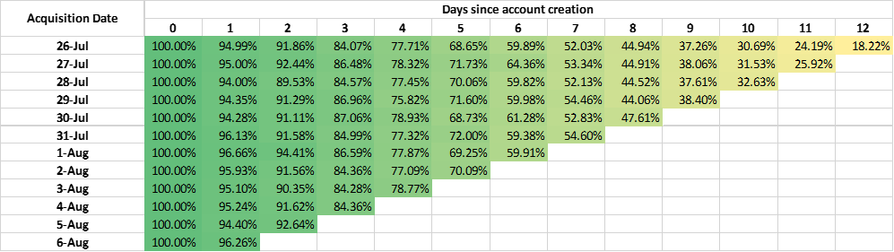
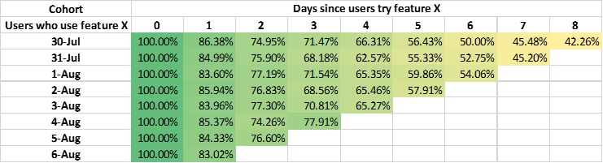
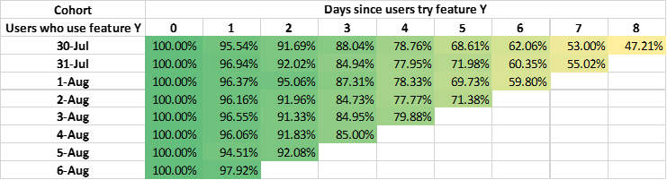

# Cohort Analysis on Finance Application
Given a set of user data for a new product, how to effectively analyze user behavior and the real user value? Conventional statistical approaches may mislead our decisions by demonstrating well-behaved average value and drawing some beautiful charts. Therefore, we are in urgent need of mastering an effective method to capture the real user value. Data never lies. However, sometimes the people who analyze the data do not do the appropriate analysis, which leads to the wrong interpretation of the user data! As an efficient data analysis method, cohort analysis is not only suitable for medical research but also of great importance for analyzing diverse groups of people in financial area.

## What is cohort analysis in finance application?

A cohort is a subdivision of a user group, which refers to the group of users with common behavior characteristics in a specified time. Acquisition cohorts and behavioral cohorts are the two common segments, in which users are grouped by stage in the user journey and their actions in a product, respectively. Common behavioral characteristics refer to similar behaviors within a certain period, which can be categorized by different behaviors and contrasting times. For example, the users whose first purchase is in January 2021 may be grouped as a cohort. Or the frequency of use of product starts to drop in the last month of January 2021. Note that cohort analysis focuses on analyzing the differences between separate groups at the same stage of the customer life cycle.

## How to Apply Cohort Analysis in Retention Analysis?

Cohort analysis can be used in various scenarios in commercial areas, like retention analysis, churn analysis, renewal analysis, and advertising analysis. We take the retention analysis as an example to show how cohort analysis improves effectiveness for retention rate analysis.

Retention table for Product A.

Retention table for Product B.

### Acquisition cohorts:
Suppose your company has two new products (Product A, Product B) released in the same period and our task is to predict which Product should be put more effort on. The user data are shown in above two ables, which consists of the retention rate of two products in each month. The retention rate is defined as the ratio of customers who are still frequently using this product. So how to read this table? Firstly, let us look at the first row of data, in which there are 100% new registrations in the first month and 95% of users remaining in the second month. In the third month, 3% of the users fall away. By that analogy, the number of retentions rate is 45% in the 9th month. We can analyze the other row data in the same way. We can know the trend of retention rate for each group of newly registered users from each row. And beyond that, we can compare the retention rate of separate groups in the column domain.

In the first few months, the retention rate of A is higher than that of B, and the simple conclusion is that Product A is more popular than Product B. Conversely, if we take a long-term view, we find that the retention rate of Product A continues to decline, while the retention rate of Product B slowly converges to a certain value. The retention trend of an excellent product should have the following characteristics:

- The retention rate in the horizontal view should stay at a fixed value. For example, there are 100 inexperienced users in a certain month and the retention rate is stable at 50% after half a year, which means that this group of users will be valuable for the company. Otherwise, even though the retention rate declines very slowly, it may go to zero in the end. No matter how many inexperienced users there are, it is meaningless for the long-term development.
- The retention data in the vertical view should be getting better. The company should constantly improve products and experiences based on users’ feedback. The users who join later should enjoy a more excellent product and service, thus leading to a higher retention rate.
  
But if we think a little bit more carefully. It is found that the promotion of Product A is mostly online and a small part offline, while Product B is just the opposite. Consequently, if we want to analyze the data more precisely, we need to break it down a bit more.

### Behavioral cohorts:
Another popular method to group the users is based on the behaviors. For example, suppose that Product A is an APP and it has several different core features. If we want to know which core feature of APP A is of benefit to the user retention, the behavior cohort analysis can be conducted. If we measure the retention rate of Product A after users using the core feature X and core feture Y, we can learn the influence of the two core features over users' preference over this product.

Behavioral cohort analysis results for core feature X and core feature Y.

The above two tables show that the retention rate in the first table drops rapidly, which means that users does not like this core feature. Therefore, we need to improve this core feature as soon as possible.
Compared to acquisition cohort, behavioral cohort depends more on the characteristics of the product and should be able to capture more valuable user information if it is utilized effectively. 

The strength of cohort analysis is that it can not only demonstrates how people like the product but also tell us why they use or leave our product. Cohort analysis can help us to identify the merits and demerits of the product in different views, thus showing us the way to make a good product. 