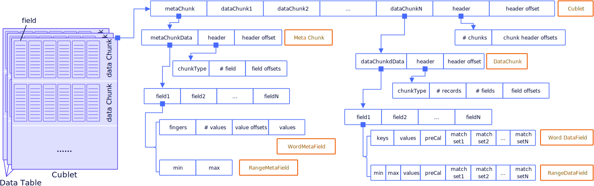

# Data Formats
COOL uses a native column-oriented data format to facilitate cohort and analytical queries. The storage hierarchy is summarized in the figure. 

 

A COOL Instance stores a dataset as a set of data tables under a directory. Each data table corresponds to a subdirectory, and it is horizontally partitioned into cublets, which follow the storage layout shown in the figure. A cublet is further horizontally partitioned into chunks. Within each chunk, data are stored by column, and metadata and indexes are built to speed up queries. For each table, a YAML file is needed to specify its schema. An example directory structure is shown here:

```
dataset
├── cube-0
│   ├── table-cube-0.yaml
│   └── version-0
│       ├── cublet-0.7z
│       ├── cublet-1.7z
│       └── cublet-2.7z
└── cube-1
    ├── table-cube-1.yaml
    └── version-0
        ├── cublet-0.7z
        └── cublet-1.7z
```

COOL supports multiple popular [input data formats](input-format.md), from which the system can automatically convert them into native storage format.

## Cublet
A Cublet is a file with one [MetaChunks](#MetaChunk) and one or more [DataChunks](#DataChunk) to store a group of records. It uses a list of offsets to quickly locate each chunk. 

In most cases, users have some features that are invariant, such as birth year and gender. To make the storage more efficient, COOL removes the redundant data and stores the invariant data in the metachunk.

Bytes written to a file:
```
|-datachunks-|-metachunk-|-header-|-header offset-|
```
The header includes:
```
|-#chunk-|-chunk offsets-|
```

## MetaChunk
A MetaChunk describes the value ranges of each dimension in a MetaField. It keeps a list of offsets, one for each MetaField to quickly locate them. 

Bytes written to a file:
```
|-metachunks-|-header-|-header offset-|
```
The header includes:
```
|-chunkType-|-#field-|-field offsets-|
```
### HashMetaField
A HashMetaField describes a field of type [AppKey](schema.md#appkey), [Action](schema.md#action) and [Segment](schema.md#segment). It stores a field metadata as follows:
* `finger`: the sorted list of hash values compressed. It is used to locate the value and its global id.
* `global ids`: the global id assigned to each of the value in the order of their position in finger. 
* `#values`: number of values
* `value offsets`: the offset of each value in `values` in the order of their position in finger.
* `values`: the list of unique values of the field, with the same sort order as in finger.
The bytes spanning `#values`, `value offsets` and `values` are compressed with lz4.

Bytes written to file:
```
|-finger compressor codec-|-compressed finger-|-global ids compressor codec-|-compressed codec-|-values compressor codec-|-compressed values-| 
```
compressed values bytes (in uncompressed form):
```
|-#values-|-value offsets-|-values-|
```

### UserMetaField
UserField is based on HashField. But the field type is [UserKey](schema.md#userkey). Invariant data will be stored only once, so invariant data is stored in the metachunk with UserKey. UserMetaField has some new variants compared with HashMetaField.

* `sortedFinger`: the sorted list of hash values compressed. `finger` is sorted by the key, but `sortedFinger` is sorted by global ids. It is used to locate the user to get the invariant data.

* `sortedGlobal ids`: sorted vector of `global ids`. When processing the invariant data, we only know the global id of the user, `sortedGlobal ids` is used to help with the location of the user in the vector of invariant data.

* `userToInvariant`: the vector to store the mapping between the user and invariant data. It should be noted that `String` data is stored as a hash key.

Bytes written to file:
```
|-finger compressor codec-|-compressed finger-|-sorted finger compressor codec-|-global ids compressor codec-|-compressed global ids-|-sorted compressed global ids-|-values compressor codec-|-compressed values-| 
```
compressed values bytes (in uncompressed form):
```
|-#values-|-value offsets-|-values-|
```

### RangeMetaField
A RangeMetaField describes a field of type [ActionTime](schema.md#actiontime) and [Metric](schema.md#Metric). These raw values of these fields are numbers. Currently, their min and max are stored here.
## DataChunk
A data chunk store a group of record in column oriented manner. There are two types of format, HashField and RangeField for different field types with tailored indexing and compression. It should be noted that invariant data fields are stored in metachunk with `UserKey` rather than in datachunks.

### HashField
A HashField describes the values in each record of a field that belongs to a type described by HashMetaField.
* `keys`: global ids of terms appeared in this data chunk, in ascending order.
* `values`: a value the field takes is represented with a local id, which is the index of its global id in `keys`.
* `preCal` and `match sets`: when pre-calculation is specified, one or more bit sets (`match sets`) are stored in place of values.

Bytes written to file: (when pre-calculation is off)
```
|-key compressor codec-|-compressed keys-|-values compressor codec-|-values-|
```
Bytes written to file: (when pre-calculation is on)
```
|-key compressor codec-|-compressed keys-|-PreCal codec-|-#bitset-|-compresed bitsets-|
```
Currently the bitset is compressed with run-length encoding
### RangeField
A HashField describes the values in each records of a field that belongs to a type described by HashMetaField.

Bytes written to a file:
```
|-range codec-|-min-|-max-|-values compressor codec-|-compressed values-|
```