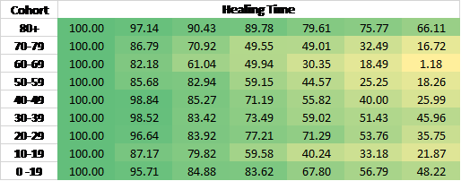
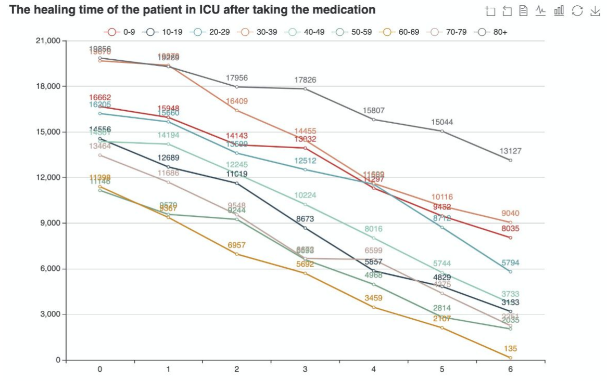
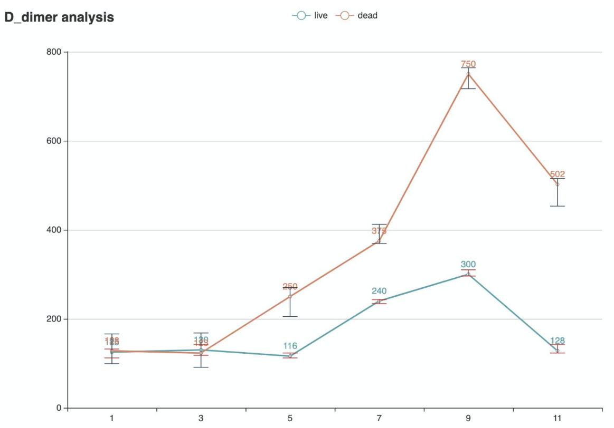
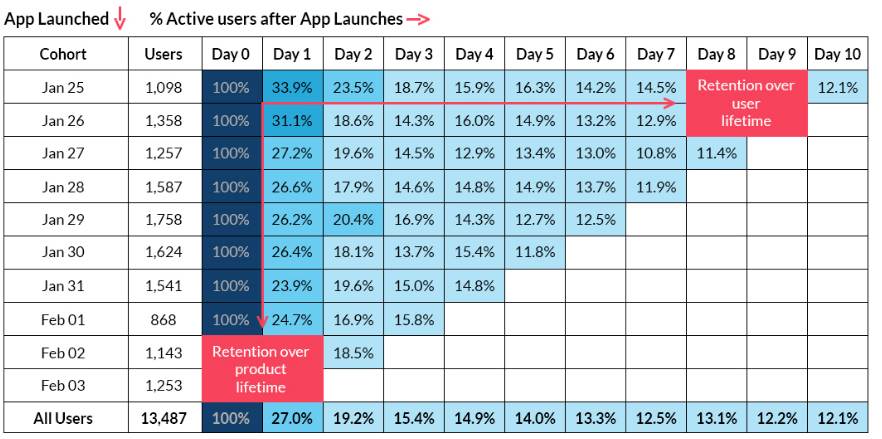

Although cohort analysis has been widely used in many different areas, most of these applications are very simple. In most cases, users are divided into different cohorts according to some attributes. For example, in health care scenario, the study of one medicine usually directly divides patients according to their age or birthplace. Then only some simple statistical data of cohorts like average value or sum will be used. Although these are the easiest way to perform cohort analysis, they cannot provide a deeper insight into cohorts to us. To address these limits, COOL provide more complex and precise cohort analysis and is of great importance for the following applications.

# HealthCare
Cohort analysis can be used in healthcare to analyze electronic medical records and investigate the therapeutic effect of drugs. We can take the medication analysis in COVID-19 as an example to show how to conduct cohort analysis. Firstly, we select the patients with COVID-19 as the main group. Divide this group by treatment locations (isolation ward or ICU). Find different recovering time among the patients in different age groups from taking a certain medication. In this case, we can explore the average healing time from taking medication to recovery among patients of different age groups. From these visualization results (Figure 1 and Figure 2), we could find that this kind of drug works well on the age 60-69 group.

Figure 1. The healing time of the patient in ICU after taking the medication.

Figure 2. Line chart for the healing time of the patient in ICU after taking the medication​.

Besides, with COOL system, we could explore the risk factors in the COVID19 patients (time-series features such as vital signs, lab tests), and we could directly see the difference. We take the D-dimer as an example and explore the difference between the patients who are survival or not in the ICU. From Figure 3, we could find that the fluctuation of the vital sign (D dimer) among the survival patients is more stable than the patients who are not.

Figure 3. D_dmer analysis

# Retention Analysis

For a company who have released a new product or service, conventional statistical approaches may mislead the decisions by demonstrating well-behaved average value and drawing some beautiful charts. As a behavior analytics concept, cohort is an important set of potential customers for the companies. To get a better understanding of the user behaviors of these potential customers, cohort analysis can help to measure user engagement over time and identify whether user engagement is actually getting better over time or is only appearing to improve because of growth.

We take the App launch as an example to do the retention analysis. The following table is a cohort table, which shows daily cohort of users who have launched an app first time and revisited the app in the next 10 days. We can get an overview of the users’ behaviors in visiting this App by looking the retention ratio for each row. Without the cohort table, we can only know some statistical features, like average daily visit, visit growth and overall registered users. However, the churn rate and retention ratio will be overlooked, thus leading to inefficient analysis of user behaviors. By contrast, we can learn the users’ product lifetime from the cohort table by comparing different cohorts at the same stage in their life cycle. We can see the percentage of people in a cohort are coming back to app after 3 days and so on. The early lifetime months can be linked to the quality of your onboarding experience and the performance of customer success team. In addition, we can also learn user lifetime by studying the long term relationship with people in any cohort. to ascertain how long people are coming back and how strong or how valuable that cohort is. This can be presumably linked to something like the quality of the product, operations, and customer support.

Figure 4. Cohort table for one App launch.

After getting the user lifetime and product lifetime from the cohort table, we can know how to improve retention ratio by breaking the groups of users with sophisticated cohort analysis. For example, we can analyze how the new users are acquired and compare the retention performance and put more efforts on the acquisition channels in the future. We can also conduct behavioral cohort analysis to track how the users behave over time. 

# Collective fraud detection
E-commerce fraud is a major problem across all industries and sectors, but for online platform, in particular, it's especially concerning. Collective frauds, which conduct fraud transactions using massive suspicious accounts, will cause great loss to platforms and damage the e-commerce environment. Generally speaking, these collective suspicious accounts are controlled by the same organization or people. In order to reduce the time and hardware resource, the fraud organization and fraudsters tend to operate these accounts in the same devices and the corresponding user behavior will be in the similar pattern. Fraudsters use high-technique tools to control multiple accounts, such as emulator, phone farm, pseudo base-station, VPN and Modem pool. 

Figure 5 Example of emulator and phone farm.

Collective fraud detection can be conducted in two different stages of user behaviors: account registration and account activity. In users’ account registration stage, fraud organizations usually register massive accounts with a group of devices, email address and phone number. By contrast, normal accounts demonstrate more evenly registration behavior since they only register one account every time. The user cohort can be obtained by their actions such as login, payment or writing reviews. The suspicious accounts from the same fraud organizations will demonstrate similar time series patterns and this can be learned by downstream machine learning models. 