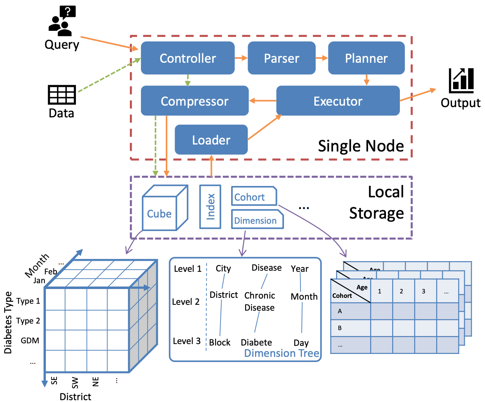
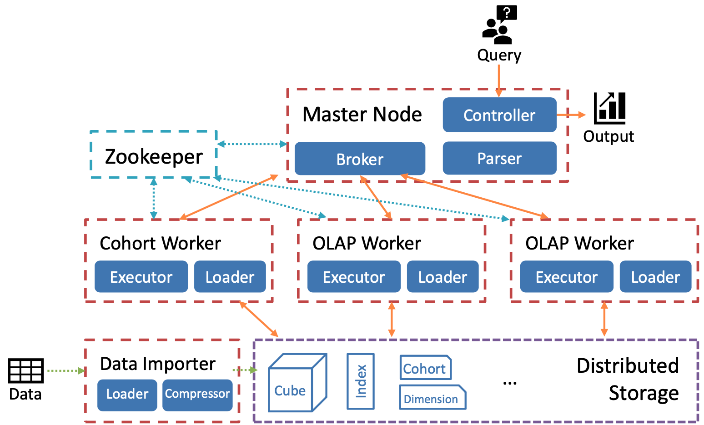

## Architecture

### Single-node architecture
The single-node architecture of Cool have six components in the system as illustrated in the following Figure, consisting of loader, controller, parser, planner, compressor and executor. The key components are detailed as follows:

Cool Single-node System Architecture.

1. **Data Model**

    Similar to conventional databases, COOL organizes data records in tables. Each table is maintained by a user-defined schema, consisting of multiple columns called fields or dimensions. A dimension file recording the hierarchy of several dimensions is also given by the users in order to support cube queries. Each dimension of the table is bound to a field type describing the format of the values. The primitive types include varied-length integer, float, string, boolean, time and event. The first four are similar to underlying database types while the remaining types are specifically defined by COOL. Time deals with the timestamps of the records and event is a particular string representing user actions or behaviors. A dimension tree is constructed in system setup guided by the dimension file and persisted in storage, as shown in above Figure. COOL employs a hybrid orientation plan for data storage, as depicted in the above Figure. The tables are horizontally split into different partitions called cublets. Each cublet consists of multiple chunks, where the metaChunk contains all the values for a corresponding field in this cublet.

    In Cool, all the queries are written in JSON format with a pre-defined syntax. Two types of queries are supported: (1) OLAP Query. Cool can be treated as a conventional OLAP system dealing with cube queries. The system supports basic cube operations, including roll-up, drill-down, pivot and slice and dice, upon data cubes built atop the fields and the dimension tree. Cool can also provide responses for iceberg query [33], a prevailing type of query selecting a small number of records which satisfy some given conditions. (2) Cohort Query. Cool can support an enhanced version of cohort queries. Traditional cohort query, as defined in Cohana, can only support aggregations on cohorts born with a single event along a fixed time window. However, Cool supports aggregations on cohorts born with a series of events, namely an event sequence, along either a fixed time window or an elastic time window delimited by given events. 

    Cool supports composite query processing by running a successive query atop the result of a precedent query. The type of the precedent query and the successive query can be any combination of the two aforementioned query types. For instance, a cohort generated in a precedent cohort query can act as a data source for either a successive OLAP query or a successive cohort query. Such composite query is sometimes called funnel analysis in the literature. In the implementation, based on the user-defined schema and the dimension tree, data cube and cohort are stored conceptually as the intermediate structures to support such query, as shown in the bottom part of Figure 1. The meaning of “conceptually” here is that Cool materializes the matched records of the precedent query as well as the corresponding dimension structure in the storage layer and aggregates the corresponding results in runtime, instead of storing the resultant cohort or data cube tuples directly. By default, such intermediate structures exist in a fixed period and the system can be configured to persist them permanently.

1. **Storage Layout**
2. **Query Processing**

### Distributed architecture

