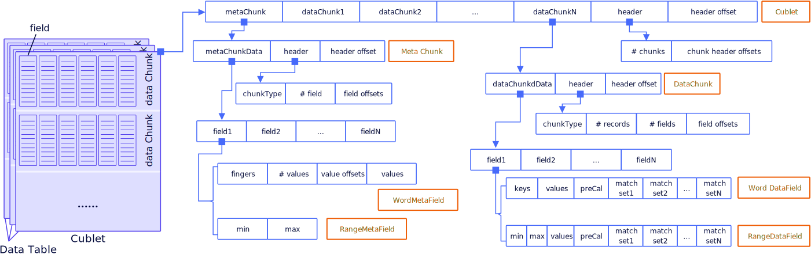

# Data Formats
COOL uses a native column-oriented data format to facilitates cohort and analytical queries. The storage hierarchy is summarized in the figure. 

 

A COOL Instance stores a dataset as a set of data tables under a directory. Each data table corresponds to a subdirectory and it is horizontally partitioned into cublets, which follows the storage layout shown in the figure. A cublet is further horizotally partitioned into chunks. Within each chunk, data are stored by column, and metadata and indexes are built to speed up queries. For each table, a yaml file is needed to specify its schema. An example directory structure is shown here:

```
dataset
├── cube-0
│   ├── table-cube-0.yaml
│   └── version-0
│       ├── cublet-0.7z
│       ├── cublet-1.7z
│       └── cublet-2.7z
└── cube-1
    ├── table-cube-1.yaml
    └── version-0
        ├── cublet-0.7z
        └── cublet-1.7z
```

COOL supports multiple popular input data formats, from which the system can automatically convert them into native storage format. Besides that users can model the [CSV LocalLoader](https://github.com/COOL-cohort/COOL/blob/main/src/main/java/com/nus/cool/loader/LocalLoader.java) to create customized loader. We plan to add a common loader interface in the future to make extension easier.

## CSV
COOL requires two additional files besides the csv file that contains raw data.
* table.yaml: a yaml file that specifies the schema
* dimension.csv: a csv file that specifies the value range of each dimension

COOL [CSV LocalLoader](https://github.com/COOL-cohort/COOL/blob/main/src/main/java/com/nus/cool/loader/LocalLoader.java) takes these information to parse the csv data and create indexes. Please refer to [CSV Tutorial](tutorials/tutorial-csv.md) for a complete example.
