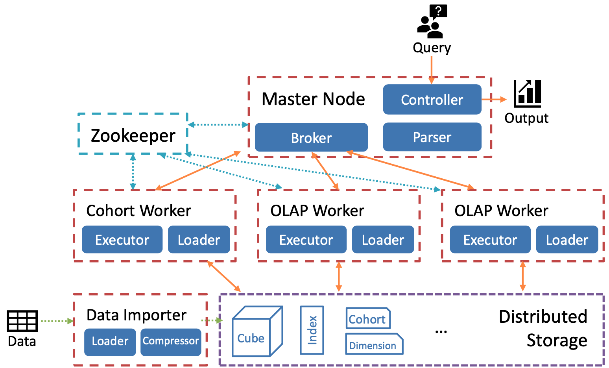

# Cluster Setting

## Distributed Architecture



## Distributed Operation

COOL can also be deployed as a scalable, distributed cluster.


### Requirements

zookeeper,  hdfs

### Deployment

#### Deploy HDFS

Follow the Pseudo-distributed Operation [instruction](https://hadoop.apache.org/docs/stable/hadoop-project-dist/hadoop-common/SingleCluster.html)

#### Deploy zookeeper

Follow zookeeper started [guide](https://zookeeper.apache.org/doc/r3.3.3/zookeeperStarted.html)

#### RUN broker and worker in COOL

1. Run many workers, each worker has a unique port

   ```bash
   java -jar cool-queryserver/target/cool-queryserver-0.0.1-SNAPSHOT.jar /COOL/datasetSource/ 9011 WORKER
   ```

   ```
   java -jar cool-queryserver/target/cool-queryserver-0.0.1-SNAPSHOT.jar /COOL/datasetSource/ 9012 WORKER
   ```

2. Run broker

   ```bash
   java -jar cool-queryserver/target/cool-queryserver-0.0.1-SNAPSHOT.jar /COOL/datasetSource/ 9013 BROKER
   ```

### Datasets

Manually upload used Cublet, query.json file to HDFS

- Upload all partitioned .dz files to HDFS path: `/cube/` eg. `"/cube/health/v1/1805b2fdb75v2.dz"`, `"/cube/health/v1/1804bc18968.dz"`
- Upload query.json file to `/tmp/queryID` folder, eg. `"/tmp/1/query.json"`
- Upload table.yaml file to same folder of cube, eg, `"/cube/health/v1/table.yaml"`

### API

In distributed mode, the client can only talk to the broker.

- \[server:port]: info

    - List all workable urls

  ```bash
  curl --location --request GET 'http://localhost:9009/info'
  ```

- \[server:port]: /cohort/cohort-analysis

    - Perform distributed cohort analysis

  ```bash
  curl --location --request GET 'http://127.0.0.1:9013/broker/execute?queryId=1&type=cohort'
  ```

    - Result is stored at HDFS. 