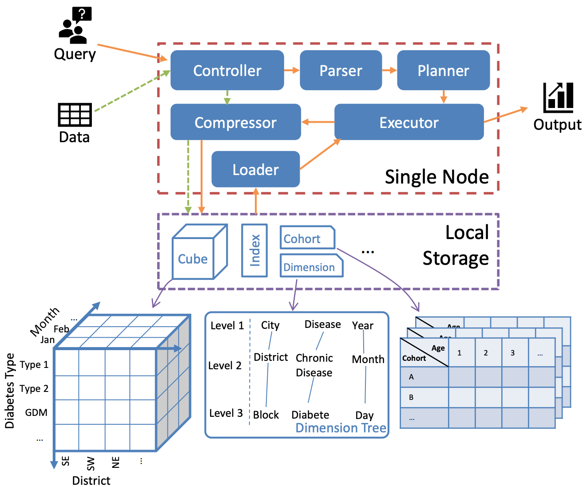

# What is cohort analysis
# why do we need cohort analysis

# Introduction to COOL

Apache COOL is an online cohort analytical processing system that supports various types of data analytics, including cube query, iceberg query and cohort query. The objective of COOL is to provide high performance (near real-time) analytical response for emerging data warehouse domain.
COOL is a cohort OLAP system specialized for cohort analysis with extremely low latency. As the first OLAP system, which can process both cohort queries and conventional OLAP queries, COOL outperforms other systems by a wide margin in single-node setting. Its multi-node version can also beat other systems by one order of magnitude in terms of query latency.

The common applications of COOL are:

- To be continued.
- **Healthcare.**
- **Customer Relationship Management (CRM) Analytics.**
- **Electronic medical record analysis**
- **Retention analysis in financial area**
- **Anomaly detection in physical system**
- **Anti-fraud in e-commerce platform**
- **Advertising analytics**

## Key features of COOL

1. **Easy to use.** COOL provides user-friendly API, thus allowing users to easily deploy a web app to utilize COOL on local or on cloud via docker.
2. **Near Real-time Responses.** COOL is highly efficient, and therefore, can process cohort queries in near real-time analytical responses.
3. **Scalable distributed architecture.** COOL can be extened for distributed processing to serve big data needs without compromising the ability and efficiency in supporting both OLAP and cohort queries.
4. **Specialized Storage Layout.** A specialized storage layout is designed for fast query processing and reduced space consumption.
5. **Self-designed Semantics.** There are some novel self-designed semantics for the cohort query, which can simplify its complexity and improve its functionality.
6. **Flexible Integration.** Since COOL supports various types of data, it can be integrated with other data systems via common data formats e.g., CSV, Parquet, Avro, and Arrow. This also makes COOL suitable for many different application scenarios.
7. **Artificial Intelligence Model.** Utilize COOL's cohort results and findings to facilitate building artificial intelligence models.

## When Should I Use COOL?
In some real applications, you need to compare the behaviors between different groups of users (customers, patients, or physical systems) and study the time serires characteristics. Therefoer, you will use cohort query to explore the user behavioral patterns from two perspectives, i.e. aging and social changes. More specifically, COOL is the perfect system for you if you have any requirements as follows:
1. **Time series data analytics.** For the time series data, cohort analysis will analyze its behavioral patterns and make predictions for future behavior.
2. **Data is easy to group.** If the data is easy to group by the birth (age for patients, registration for accounts), or event(patients taking a medicine, or buyers purchasing one product), cohort query in COOL will perform much fast than other OLAP systems. 
3. **The application require real-time reponse.** COOL provide real-time reponse for the cohort query and conventional OLAP queries, thus suitable for the online system.  
4. **Deal with various data format.** COOL support various data format and will automatically convert the input data to native storage format. 
5. **System need to be scalable.** 
6. To be continued.

## Architecture
### Single-node architecture
The single-node architecture of Cool have six components in the system as illustrated in the following Figure, consisting of loader, controller, parser, planner, compressor and executor. The key components are detailed as follows:

Cool Single-node System Architecture.

1. **Data Model**
1. **Storage Layout**
2. **Query Processing**

### Distributed architecture
