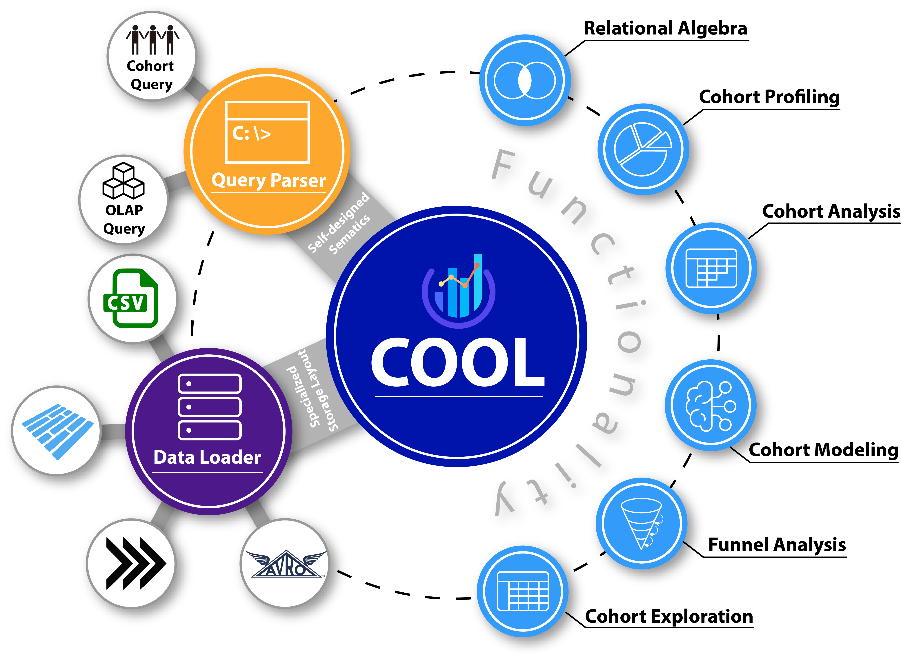

Sometimes you want to link to assets (e.g. docx files, images...) directly from Markdown files, and it is convenient to co-locate the asset next to the Markdown file using it.

Let's imagine the following file structure:

```
# Your doc
/website/docs/myFeature.mdx

# Some assets you want to use
/website/docs/assets/images/arch.png
```

## Images {#images}

You can display images in three different ways: Markdown syntax, JSX require or ES imports syntax.

Display images using simple Markdown syntax:

```mdx

```

Display images using inline CommonJS `require` in JSX image tag:

```mdx

```

Display images using ES `import` syntax and JSX image tag:

```mdx
import myImageUrl from '../assets/images/arch.png';


```

This results in displaying the image:


## Files {#files}

In the same way, you can link to existing assets by requiring them and using the returned url in videos, links etc.

```mdx
# My Markdown page

<a
  target="_blank"
  href={require('../assets/images/arch.png').default}>
  Download this docx
</a>

[Download this png using Markdown](../assets/images/arch.png)
```

<a
  target="_blank"
  href={require('../assets/images/arch.png').default}>
  Download this docx
</a>

[Download this png using Markdown](../assets/images/arch.png)

## Inline SVGs {#inline-svgs}

Docusaurus supports inlining SVGs out of the box.

import DocusaurusSvg from '@site/static//assets/icons/svg/logo.svg';

<DocusaurusSvg />

This can be useful, if you want to alter the part of the SVG image via CSS. For example, you can change one of the SVG colors based on the current theme.

```jsx
import DocusaurusSvg from './docusaurus.svg';

<DocusaurusSvg className="themedDocusaurus" />;
```

```css
html[data-theme='light'] .themedDocusaurus [fill='#FFFF50'] {
  fill: greenyellow;
}

html[data-theme='dark'] .themedDocusaurus [fill='#FFFF50'] {
  fill: seagreen;
}
```

<DocusaurusSvg className="themedDocusaurus" />

## Themed Images {#themed-images}

Docusaurus supports themed images: the `ThemedImage` component (included in the themes) allows you to switch the image source based on the current theme.

```jsx {5-8}
import ThemedImage from '@theme/ThemedImage';

<ThemedImage
  alt="Docusaurus themed image"
  sources={{
    light: useBaseUrl('/img/docusaurus_light.svg'),
    dark: useBaseUrl('/img/docusaurus_dark.svg'),
  }}
/>;
```

```mdx-code-block
import useBaseUrl from '@docusaurus/useBaseUrl';
import ThemedImage from '@theme/ThemedImage';

<ThemedImage
  alt="Docusaurus themed image"
  sources={{
    light: useBaseUrl('./assets/icons/svg/logo.svg'),
    dark: useBaseUrl('./assets/icons/svg/logo.svg'),
  }}
/>
```

## Static assets {#static-assets}

If a Markdown link or image has an absolute path, the path will be seen as a file path and will be resolved from the static directories. For example, if you have configured [static directories] to be `['public', 'static']`, then for the following image:


Docusaurus will try to look for it in both `static/img/docusaurus.png` and `public/img/docusaurus.png`. The link will then be converted to a `require` call instead of staying as a URL. This is desirable in two regards:

1. You don't have to worry about base URL, which Docusaurus will take care of when serving the asset;
2. The image enters Webpack's build pipeline and its name will be appended by a hash, which enables browsers to aggressively cache the image and improves your site's performance.
